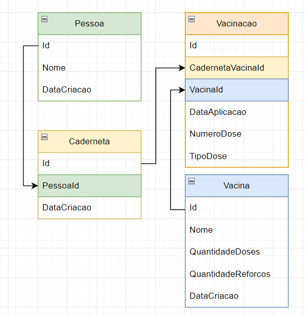

# Cartao de Vacina

Sistema que permite cadastrar Vacinas, Pessoas e efetuar a aplicacao das doses.

Para executar é necessário ter instalado:
- SQL Server

Ao executar a aplicacao ela irá cadastrar dados inicias no banco.

## Modelagem do banco

O banco de dados esta com a seguinte modelagem:

Desta forma, a cada pessoa cadastrada e gerada uma nova caderneta vinculada a ela. Cada dose que a pessoa tomar sera vinculada tambem a sua caderneta em forma de vacinacao.

### Vacina

Cada vacina e cadastrada recebendo a informacao de quantas doses e quantas doses de reforco ela possui.

## Vacinacao - Doses

A caderneta de vacinas possui uma lista de Vacinacao, que é o ato de receber uma aplicacao e essa vacinacao indica qual o tipo e numero da dose aplicada.

As doses estao divididas em 2 tipos:
- 1 -> Comum
- 2 -> Reforco

Para receber uma dose de reforco a pessoa deve ter recebido todas as doses comuns.